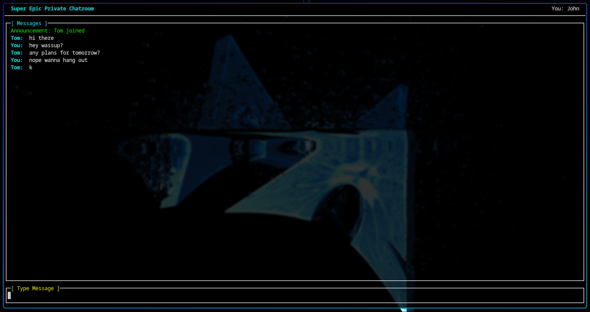
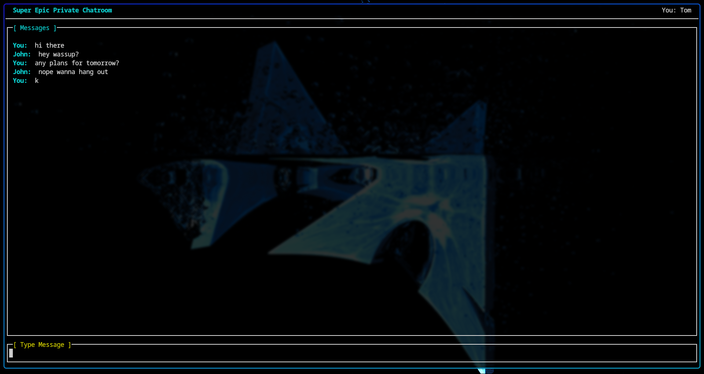

# Chatroom

## About
This is a chatroom I made entirely with C only using ENet for UDP networking and ncurses which is a famous library for TUI.
Within days and following tutorials, I was able to make this

## Screenshots
### Client 0 (John)

### Client 1 (Tom)

## Features
### Client
- write messages with up to 31 other clients in the chatroom
- pick any username you want with unique client id to differentiate
- encryption between clients by all using the same key
  
### Server
- let connect up to 32 clients
- some information which is not sensitive due to encryption
- only functions as manager and service provider

### Planned
- upgrade Server TUI
- look up users from ID (not username!)
- maybe able to ban users?
